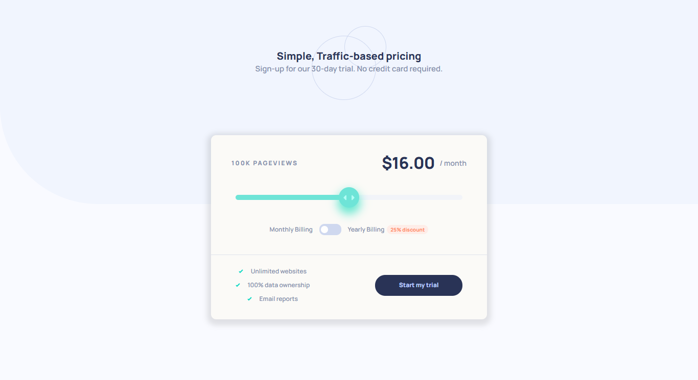

## Table of contents

- [Overview](#overview)
  - [Screenshot](#screenshot)
  - [Links](#links)
- [Getting Started](#getting-started)
- [Features](#features)
- [Usage](#usage)
- [My process](#my-process)
  - [Built with](#built-with)
  - [What I learned](#what-i-learned)
  - [Continued development](#continued-development)
- [Contributing](#contributing)
- [License](#license)

## Overview

### Screenshot



### Links

- Solution URL: [https://github.com/mikewil245/interactive-pricing-component-main.git](https://your-solution-url.com)
- Live Site URL: https://jolly-kringle-f9b598.netlify.app/

## Getting Started

To get a local copy up and running follow these simple steps.

### Prerequisites

List any prerequisites here.

### Installation

1. Clone the repo
   ```sh
   git clone https://github.com/mikewil245/interactive-pricing-component-main.git
   ```
2. Install NPM packages
   ```sh
   npm install
   ```

## Features

- Feature 1
- Feature 2
- Feature 3

## Usage

Provide examples of how to use your project.

```sh
// Example command
```

## My process

### Built with

- Semantic HTML5 markup
- CSS custom properties
- Flexbox
- Mobile-first workflow

### What I learned

### Customizing input range & Using step attribute

- I learned how to customize the range input using `-webkit-appearance: none;` to remove the default range bar and then further customize it to fit the design requirements.

- Customizing the slider thumb was also an interesting challenge. By using `-webkit-appearance: none;`, I was able to remove the default slider thumb and replace it with a custom design using the `background` property.

```html
<input type="range" class="slider" name="volume" min="0" max="4" step="1" />
```

```css
.slider-container .slider {
  -webkit-appearance: none;
  width: 100%;
  height: 0.625rem;
  border-radius: 0.625rem;
  background: linear-gradient(to right, #a5f3eb 50%, #ecf0fb 50%);
  outline: none;
  opacity: 0.6;
  -webkit-transition: 0.2s;
  transition: opacity 0.2s;
}

.slider-container .slider:hover {
  opacity: 1;
}

.slider-container .slider::-webkit-slider-thumb {
  -webkit-appearance: none;
  appearance: none;
  width: 2.5rem;
  height: 2.5rem;
  padding: 1.25rem;
  border: 0;
  background: url("../images/icon-slider.svg");
  background-repeat: no-repeat;
  background-position: center;
  background-color: var(--strong-cyan-slider-background);
  box-shadow: 0rem 0.625rem 1.125rem 0.1875rem hsl(170, 95%, 44%);
  border-radius: 50%;
  cursor: pointer;
}
```

### Toggle functionality & adjacent sibling selector

- Implementing the toggle functionality was straightforward, but positioning the toggle button to move left and right was challenging. I used an input element with the class `.billing-toggle-checkbox` and type `checkbox`, and customized it similarly to the slider input.

- To position the toggle button, I used the `position` and `transform` properties. The adjacent sibling selector `(+)` and the `:checked` pseudo-class selector were used to check if the checkbox was checked and then shift the toggle button accordingly.

```css
.billing .billing-toggle-container .billing-toggle-button {
  border-radius: 50%;
  width: 0.88rem;
  height: 0.88rem;
  background-color: white;
  position: absolute;
  top: 50%;
  left: 0.1875rem;
  transform: translateY(-50%);
  transition: transform 0.3s ease, background-color 0.3s ease;
}

.billing .billing-toggle-checkbox:checked + .billing-toggle-button {
  transform: translate(1.3rem, -50%);
  background-color: white;
}
```

## Contributing

Contributions are what make the open-source community such an amazing place to learn, inspire, and create. Any contributions you make are **greatly appreciated**.

1. Fork the Project
2. Create your Feature Branch (`git checkout -b feature/AmazingFeature`)
3. Commit your Changes (`git commit -m 'Add some AmazingFeature'`)
4. Push to the Branch (`git push origin feature/AmazingFeature`)
5. Open a Pull Request

## License

Distributed under the MIT License. See `LICENSE` for more information.
